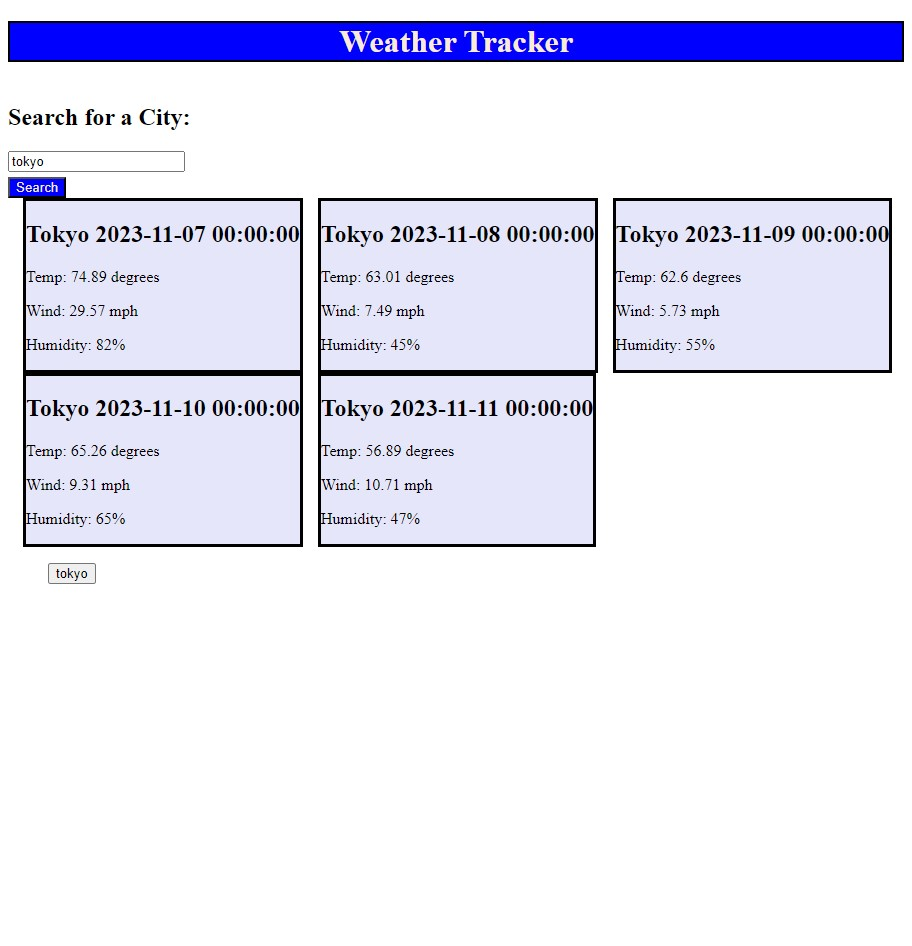

# weather-tracker

## Description
A webpage to check the weather. This project helped me understand how API's can be used in javascript.

## Screenshot

## Link to deployed webpage
https://elbringz.github.io/weather-tracker/
